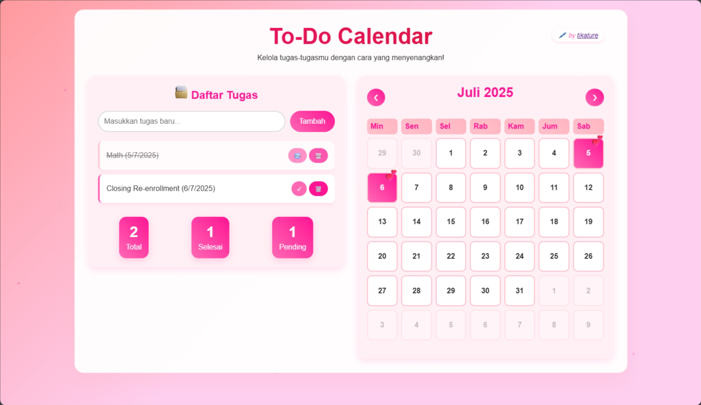

# 📅 To-Do List with Calendar

A fun and visually engaging **To-Do List** app that integrates a colorful **calendar**! Plan your day, mark your tasks, and make your productivity journey more joyful 💖✨

<p align="center">
  
</p>


---

## 🌟 Features

- ✅ Add, edit, and delete to-do tasks
- 📆 Calendar with animated icons on task dates
- 💾 Tasks saved with `localStorage` (no backend needed!)
- 💖 Custom emoji markers for fun interactions
- 📱 Responsive design for desktop & mobile

---

## 🎨 Visual Preview

Dates with tasks will show a 💖 icon using CSS animation:

```css
.calendar-day.has-task::after {
    content: '💖';
    font-size: 24px;
    position: absolute;
    top: -10px;
    right: -5px;
    animation: bounce 2s infinite;
}

```

