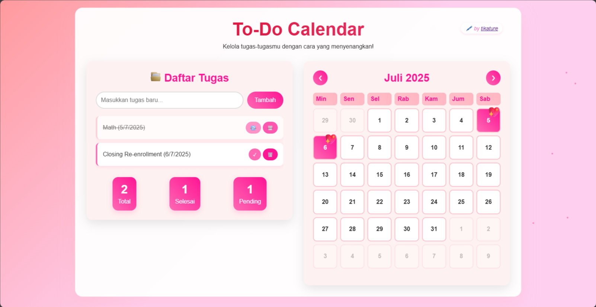

# 📅 To-Do List with Calendar

A fun and visually engaging **To-Do List** app that integrates a colorful **calendar**! Plan your day, mark your tasks, and make your productivity journey more joyful 💖✨

<p align="center">
  
</p>


---

## 🌟 Features

- ✅ Add, edit, and delete to-do tasks
- 📆 Calendar with animated icons on task dates
- 💾 Tasks saved with `localStorage` (no backend needed!)
- 💖 Custom emoji markers for fun interactions

---

## 🎨 Visual Preview

Dates with tasks will show a 💖 icon using CSS animation:

```css
.calendar-day.has-task::after {
    content: '💖';
    font-size: 24px;
    position: absolute;
    top: -10px;
    right: -5px;
    animation: bounce 2s infinite;
}

```
## 🛠️ Tech Stack

- HTML5
- CSS3 (with animations)
- JavaScript (Vanilla)
- localStorage API


---
## 🚀How to Run

1. 📦 Clone this repository
```yaml
git clone https://github.com/tikature/to-do-calendar.git
cd to-do-calendar
```
2. ▶️ Open the app
```yaml
open index.html
```


---
## 👩‍💻 Tentang Pengembang
<div align="center">

By **Dewi Atika Muthi**  
📍 _Informatics Student, Telkom University_  
📧 **Email:** detikaa10@fmail.com  
🌐 **GitHub:** [@tikature](https://github.com/tikature)  
</div>
